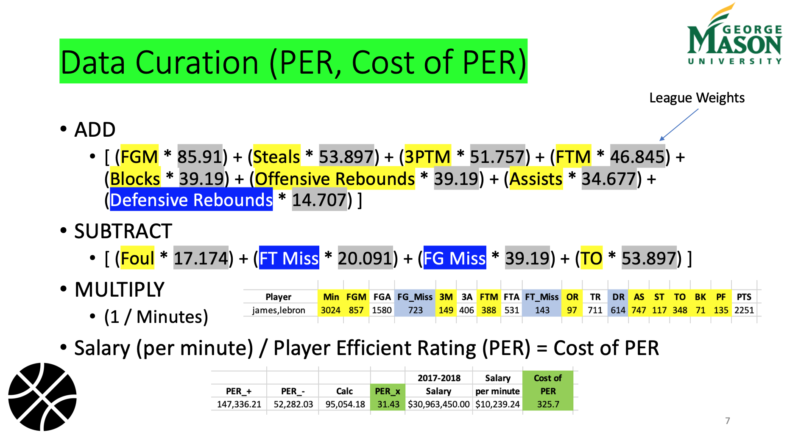

# NBA-player-performance
The project was done for my "Sports Analytics" course at George Mason University.

### Goal
The goal of this project is to analyze the Player performance compared to their peers with respect to their salaries. We then went ahead and visualized them in an interactive visualization built using GoogleVis Library in R. The project is completely built in R.

### Data:
We first scrap the data from "http://www.dougstats.com/index2.html" & "http://www.espn.com/nba/salaries". 15 years data is collected from different websites (present in PPT) and merged and wrangled to built a final dataset useful for analysis.

### Player Performance Metric:

### Visualization:
The Visualization shows the trend of performance of the player with respect to their salaries for 15 years.
Examples:

### Result:
*Question* – “Do the top NBA basketball players underperform or overperform relative to their peers when comparing annual salaries to statistical game performance?”  

*Answer(s)* – Yes, we were able to prove both (over, under) cases
- Compared two players
- Compared multiple (beyond two) players
- Compared players, based on PER, Salary averages (by position)
